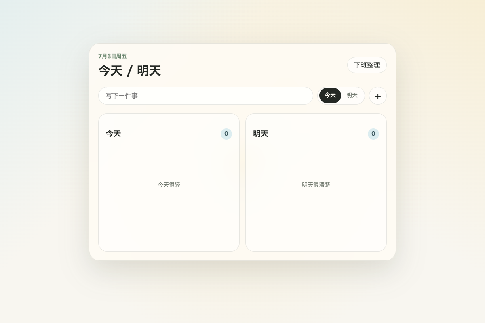
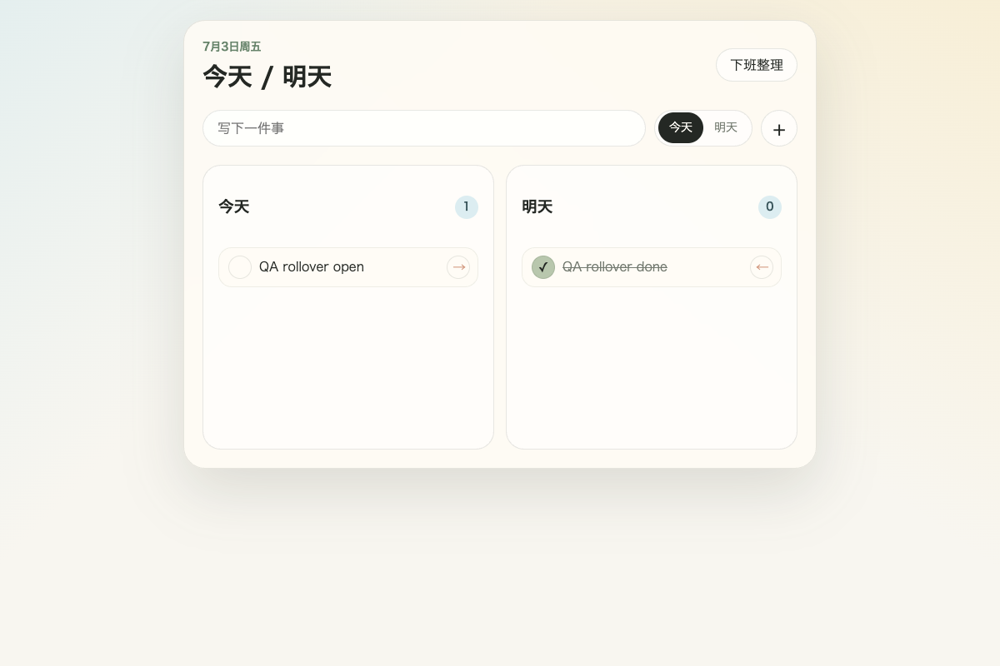
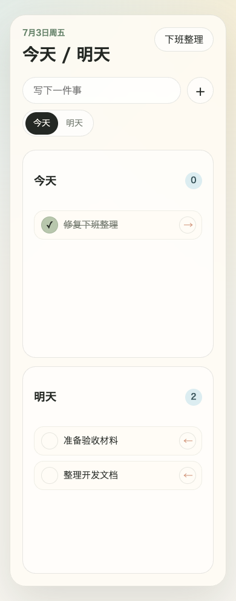

# 今天明天

今天明天是一只住在 Mac 桌面上的极简治愈系桌宠，帮助你轻量记录今天和明天的事项，并在下班前温柔地整理未完成的事。

它不是重型任务管理器，而是一个安静的日常工作陪伴：白天陪你看今天，傍晚帮你收尾，晚上把没完成的事情安放到明天。


## Preview

| 桌宠面板 | 下班整理 |
| --- | --- |
|  |  |

| 跨天滚动 | 移动端参考视图 |
| --- | --- |
|  |  |

## Product

今天明天围绕两个问题展开：

- 今天我还要做什么？
- 明天我需要接住什么？

核心体验是一条日夜循环：

1. 开工时看到今天的事项。
2. 工作中随手添加今天或明天的事项。
3. 小光团常驻桌面角落，低打扰陪伴。
4. 完成任务时获得轻微正反馈。
5. 下班前进入整理流程。
6. 未完成事项可以移动到明天。
7. 第二天，昨天的明天成为今天的开头。

## Features

- 今天 / 明天两个任务列表
- 添加、完成、重新打开、移动、放弃任务
- 本地持久化
- 本地日期滚动：明天任务跨天进入今天
- 下班整理流程
- 小光团桌宠状态：默认、开心、困倦、晚间
- 轻成长反馈：整理次数和任务状态影响视觉层级
- Tauri 双窗口桌面壳：桌宠窗口和任务面板窗口

## Tech Stack

- Tauri 2
- React 19
- TypeScript
- Vite
- Vitest
- Playwright
- pnpm

## Getting Started

安装依赖：

```bash
pnpm install
```

启动 Web 开发模式：

```bash
pnpm dev
```

运行检查：

```bash
pnpm check
pnpm build
```

启动 Tauri 桌面开发模式：

```bash
pnpm tauri:dev
```

Tauri 桌面开发需要本机安装 Rust/Cargo/rustup 和完整 Xcode。

## Scripts

| Command | Description |
| --- | --- |
| `pnpm dev` | 启动 Vite 开发服务 |
| `pnpm build` | TypeScript 检查并构建 Web 产物 |
| `pnpm preview` | 预览生产构建 |
| `pnpm lint` | 运行 ESLint |
| `pnpm typecheck` | 运行 TypeScript 类型检查 |
| `pnpm test` | 运行 Vitest 单元测试 |
| `pnpm check` | 运行 lint、typecheck、test |
| `pnpm tauri:dev` | 启动 Tauri 桌面开发模式 |
| `pnpm tauri:build` | 构建 Tauri 桌面应用 |

## Release Plan

| Version | Name | Goal | Status |
| --- | --- | --- | --- |
| `v0.1.0` | Web MVP | 完成今天 / 明天任务、下班整理、成长反馈、本地持久化、浏览器验收 | Web 行为已通过 QA；桌面发布仍阻塞 |
| `v0.2.0` | Desktop MVP | 完成 Tauri 原生桌宠窗口、任务面板窗口、拖动定位、隐藏/显示、macOS 本机运行验收 | Planned |
| `v0.3.0` | Persistence Hardening | 从 WebView `localStorage` 升级到 app-data JSON 持久化和迁移机制 | Planned |
| `v0.4.0` | Packaging Beta | 完成 macOS 打包、图标、签名准备、安装包验证、发布说明 | Planned |
| `v1.0.0` | Gentle Daily Companion | 稳定发布：核心日夜循环、桌宠体验、下班整理和本地数据可靠性达到日常使用标准 | Planned |

当前 `v0.1.0` 的 Web MVP 已通过 QA；最终桌面发布验收仍需解决：

- pnpm supply-chain policy 下的依赖锁定问题
- Rust/Cargo/rustup 和完整 Xcode 环境下的 Tauri 原生编译与运行验证

## Documentation

- [Product Spec](docs/product-spec.md)
- [Development Guide](docs/development-guide.md)
- [Architecture](docs/architecture.md)
- [QA Checklist](docs/qa-checklist.md)
- [Agent Protocol](docs/agents/interaction-protocol.md)
- [Project Foundation Plan](docs/plans/2026-07-03-project-foundation.md)

## Prototype

原始静态原型保存在：

```text
prototype/static-web/
```

可以直接打开 `prototype/static-web/index.html` 查看视觉基线。

## Repository

GitHub: [yaoruiquan/today-tomorrow](https://github.com/yaoruiquan/today-tomorrow)

